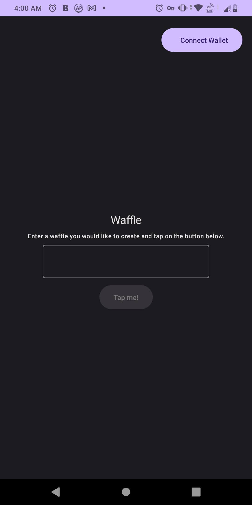
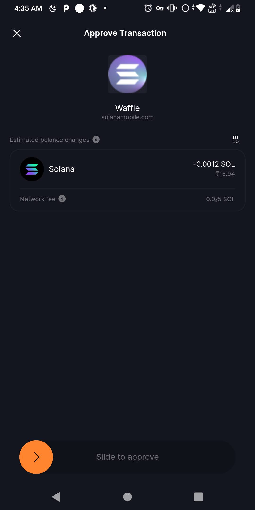
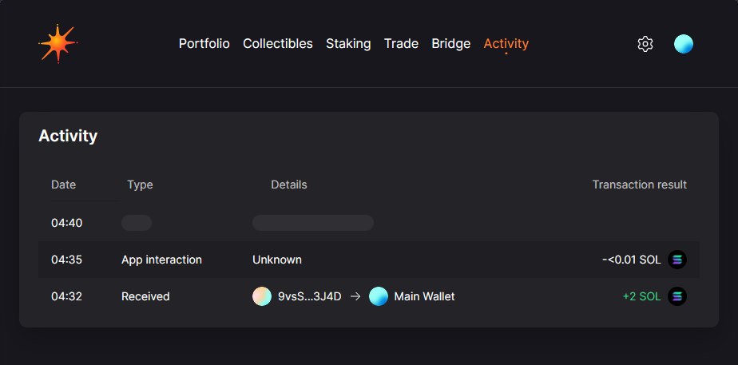
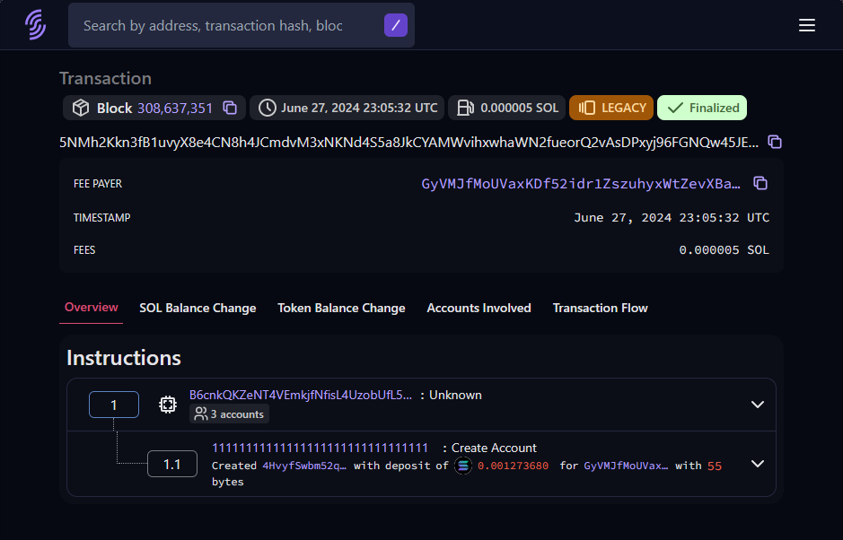

# 🧇 Waffle App

Based on the [Develop a Mobile DApp](https://learn.calyptus.co/courses/develop-a-mobile-dapp-pt-2/) lesson, this project 
Builds an Android app where users create and secure digital waffles on the Solana blockchain using WalletConnect and Anchor Smart Contracts.

## Table of Contents
- [🧇 Waffle App](#-waffle-app)
  - [Table of Contents](#table-of-contents)
  - [Getting Started](#getting-started)
  - [Contributing](#contributing)
  - [Questions](#questions)
  - [License](#license)
  - [📷 Screenshots](#-screenshots)

## Getting Started

To use this fork, you need to have [Android Studio: Giraffe | 2022.3.1](https://developer.android.com/studio/releases/past-releases/as-giraffe-release-notes), Emulator or Mobile Device (used to test the app) with a SOLANA wallet application (Solflare recommended) installed with wallet setup.

To use the fork, Open Android Studio, Click on Get from VCS and enter this url:

```bash
https://github.com/<YOUR-USERNAME>/mobile-dapp-pt2
```

## Contributing

Pull requests are welcome. For major changes, please open an issue first to discuss what you would like to change.

## Questions

Did you encounter a challenge following the tutorial or running the fork? 
Head over to our [learning support](https://discord.com/channels/1130457754826461216/1132978998155165806) channel on our [Discord](https://discord.gg/38KftAhW) or alternatively, raise a ticket. 

We are always happy to lend a helping hand

## License

All files within this repository are licensed under the MIT License unless explicitly stated otherwise.

100% Open Source software.

© 2023 [Calyptus](https://www.calyptus.co/) - See [LICENSE](https://opensource.org/license/mit/) for details.

## 📷 Screenshots
<table>
  <tbody>
    <tr>
      <td></td>
      <td></td>
    </tr>
    <tr>
      <td colspan="2"></td>
    </tr>
    <tr>
      <td colspan="2"></td>
    </tr>
  </tbody>
</table>